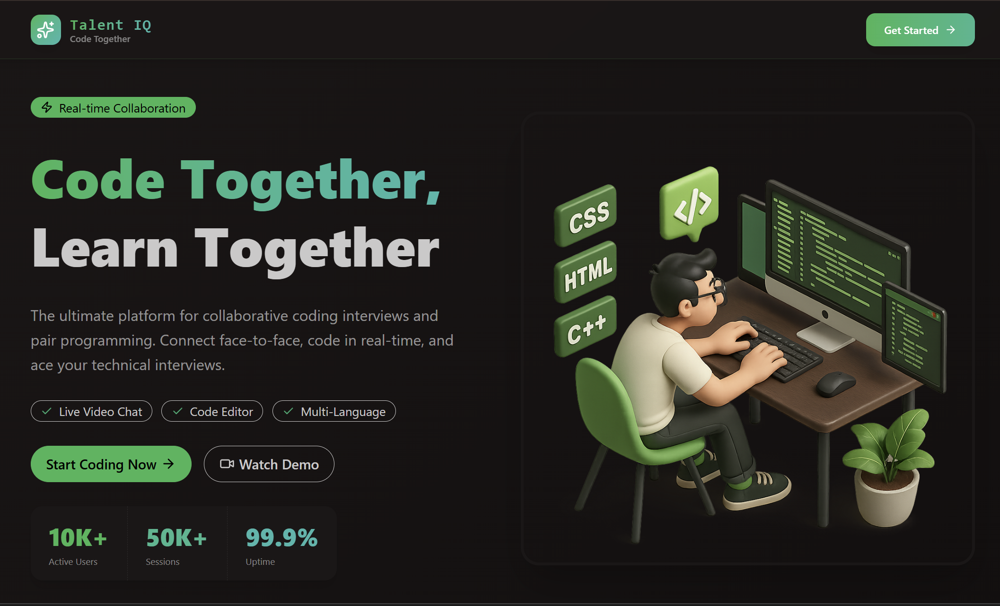

<div align="center">

# 🚀 Talent-IQ  
### Real-Time Coding Interview Platform

A full-stack real-time coding interview platform with live video calls, collaborative coding, real-time chat, and automated code evaluation — all in one system.

</div>

---

## Platform Preview

<p align="center">
  
</p>

---

## 🌟 Features

- 🧑‍💻 VSCode-powered online code editor (Monaco)
- 🎥 1-on-1 Video Interview Calls (Stream Video)
- 💬 Real-time Chat Messaging
- 🔐 Authentication & User Management (Clerk)
- ⚙️ Secure Code Execution with Test Case Evaluation
- 🎯 Auto Feedback (Pass / Fail)
- 🔒 Room Locking (Only 2 Participants Allowed)
- 🧭 Dashboard with Interview Stats
- 🧩 Practice Mode (Solo Coding)
- 🔄 Background Jobs & Webhooks (Inngest)
- ⚡ Fast Data Fetching (TanStack Query)
- 🚀 Production Deployment Ready

---

## 🏗 Tech Stack

### Frontend
- Next.js
- React
- Tailwind CSS
- TanStack Query
- Monaco Editor

### Backend
- Node.js
- Express.js
- MongoDB (Mongoose)

### Real-Time & Infrastructure
- Stream (Video + Chat)
- Clerk (Authentication)
- Inngest (Background Jobs)

---

## 🧠 System Architecture


Client (Next.js)
->
REST API (Express.js)
->
MongoDB Database
->
Real-Time Layer (Stream)
->
Background Jobs (Inngest)


---

## 🔥 Core Functionalities

### 🎥 Real-Time Video Interviews
- WebRTC-powered sessions
- Mic / Camera toggle
- Screen sharing
- Recording support

### 💬 Real-Time Chat
- Instant messaging
- WebSocket-based synchronization
- Secure channel access

### 🧑‍💻 Collaborative Code Editor
- Syntax highlighting
- Multi-language support
- Real-time coding environment

### ⚙️ Secure Code Execution
- Code runs in isolated environment
- Automatic test case validation
- Instant pass/fail feedback

### 🔐 Authentication & Sync
- Clerk-based authentication
- Webhook-driven user synchronization
- Automatic Stream user provisioning

### 🔒 Room Management
- Only 2 participants allowed
- Session locking
- Role-based access control

---

## 🚀 Getting Started

### 1️⃣ Clone the Repository

```bash
git clone https://github.com/your-username/talent-iq.git
cd talent-iq
2️⃣ Backend Setup
cd backend
npm install
npm run dev

Create a .env file inside backend:

PORT=5000
MONGO_URI=your_mongodb_uri
CLERK_SECRET_KEY=your_clerk_secret
STREAM_API_KEY=your_stream_key
STREAM_SECRET=your_stream_secret
INNGEST_SIGNING_KEY=your_inngest_key
3️⃣ Frontend Setup
cd frontend
npm install
npm run dev
📦 Deployment

Frontend/Backend  → Vercel


Database → MongoDB Atlas


